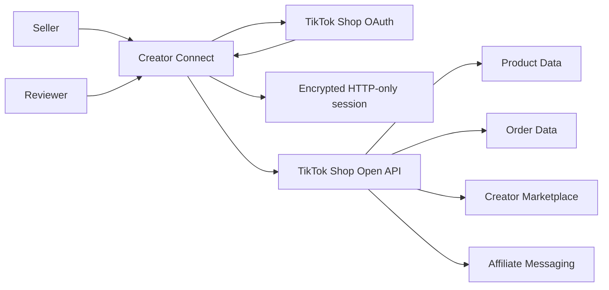

# Rabbit Bytes Creator Connect — Product Requirements Document

## 1. Product Overview

Rabbit Bytes Creator Connect is a focused TikTok Shop Public App Review POC. It gives an authorized seller a simple, secure workflow to verify synchronized shop data, discover one affiliate creator, create or retrieve one conversation, and send one intentional affiliate message.

Short description: **Manage TikTok Shop creator outreach and affiliate collaboration workflows more efficiently.**

## 2. Business Purpose

Seller teams often move between creator discovery and outreach tools. This product demonstrates a legitimate seller-authorized integration through official TikTok Shop Open APIs while keeping the first release narrow enough for reviewers to verify. It does not automate or scale outreach.

## 3. Target Users

- TikTok Shop Public App Reviewers validating the submitted integration
- TikTok Shop sellers and affiliate operators who need a direct creator discovery and messaging workflow
- Rabbit Bytes staff supporting the review and approved seller onboarding

## 4. User Journey

```text
Reviewer login
→ Connect TikTok Shop seller
→ Synchronize product and order evidence
→ Search Creator Marketplace
→ Select one creator
→ Create or retrieve conversation
→ Send one affiliate message
```

No step permits selecting multiple recipients or scheduling automated outreach.

## 5. TikTok Shop Authorization Flow

1. The reviewer authenticates to Rabbit Bytes Creator Connect using environment-managed credentials.
2. The server generates an unpredictable OAuth state and stores it in an encrypted, HTTP-only, single-use cookie.
3. The seller is redirected to the official US or Rest-of-World seller authorization URL using the Partner Center `service_id`.
4. TikTok Shop returns a short-lived code and state to `/api/tiktok/callback`.
5. The server validates state and exchanges the code at `GET https://auth.tiktok-shops.com/api/v2/token/get` with `grant_type=authorized_code`.
6. The server calls `GET /authorization/202309/shops` to retrieve all authorized shop records, including each shop cipher. If multiple shops are returned, the reviewer selects which shop context subsequent API calls use.
7. Tokens, expiry timestamps, granted scopes, and selected shop data are stored temporarily in an encrypted HTTP-only cookie.
8. A near-expiry access token is refreshed server-side through `/api/v2/token/refresh` when a valid refresh token is available.

Local and cross-border sellers use the shop returned by the authorization response. No shop ID or cipher is hardcoded.

## 6. TikTok Shop Data Sync

Route: `/data-sync`

The reviewer starts an on-demand, read-only synchronization. The server performs these independent calls in parallel:

```text
POST /product/202502/products/search
POST /order/202309/orders/search
```

The Product request uses `status: ALL`. The Order request sorts the latest records by `create_time` descending. Each request is limited to 20 records for review clarity. The UI shows the exact Product ID or Order ID returned by TikTok Shop, the authorized Shop ID, source endpoint, endpoint-specific TikTok `request_id`, and synchronization time. No product, order, or buyer data is modified; buyer personally identifiable information is not rendered. Empty results and partial endpoint errors are shown as returned and are never replaced with fabricated records.

## 7. Creator Discovery

Route: `/creators`

The seller enters a creator username or keyword. The server calls:

```text
POST /affiliate_seller/202608/marketplace_creators/search
```

The UI displays only fields returned by TikTok Shop, such as avatar, username, display name, Creator Open ID, followers, category, and region. It also displays the exact source endpoint, TikTok `request_id`, authorized Shop ID, and synchronization time. Missing identifiers are labeled as not returned and are never fabricated. Exact username lookup is not claimed; the UI explains that matches follow TikTok Shop's supported keyword search behavior.

## 8. Affiliate Creator Messaging

Route: `/messages`

Conversation creation/retrieval:

```text
POST /affiliate_seller/202508/conversations
{
  "creator_open_id": "...",
  "only_need_conversation_id": true
}
```

Text message sending:

```text
POST /affiliate_seller/202412/conversations/{conversation_id}/messages
{
  "msg_type": "TEXT",
  "content": "{\"content\":\"...\"}"
}
```

The different endpoint versions are intentional and match their respective TikTok Shop API reference pages. The send button is disabled while a request is running, input is length-limited, and server-side rate protection reduces accidental duplicate sends.

## 9. Deferred Functionality

Product and order mutation, partner campaigns, promotions, share links, showcase products, analytics, and affiliate collaboration management are not part of the current review build. Their scopes must not be requested until a corresponding user-visible workflow and endpoint integration are implemented and tested.

## 10. API Scope Mapping

| Scope | Feature | Endpoint(s) | Why required |
| --- | --- | --- | --- |
| Seller authorization / authorized shop access configured for the app | Shop connection | `GET /authorization/202309/shops` | Retrieves seller-authorized shops and the correct `shop_cipher` after token exchange |
| `seller.product.basic` | Read-only product synchronization | `POST /product/202502/products/search` | Displays exact product records and Product IDs for the authorized shop |
| `seller.order.info` | Read-only order synchronization | `POST /order/202309/orders/search` | Displays exact order records and Order IDs for the authorized shop |
| `seller.creator_marketplace.read` | Creator discovery | `POST /affiliate_seller/202608/marketplace_creators/search` | Searches Creator Marketplace for seller-selected matching creators |
| `seller.affiliate_messages.write` | Create/retrieve creator conversation | `POST /affiliate_seller/202508/conversations` | Starts or retrieves one seller-to-creator affiliate conversation |
| `seller.affiliate_messages.write` | Send one affiliate message | `POST /affiliate_seller/202412/conversations/{conversation_id}/messages` | Sends seller-authored text to the selected creator |

No product/order mutation, partner campaign, promotion, share-link, showcase-product, analytics, affiliate-collaboration, finance, fulfillment, logistics, customer-service buyer messaging, live-data, or bestseller scopes are required.

## 11. Data Flow



The browser never calls TikTok Shop directly. It sends validated requests to the Next.js server, which retrieves the encrypted session, refreshes the token if required, signs the exact path/query/body bytes, and calls TikTok Shop.

## 12. Security and Privacy

- Review authentication uses environment variables and an encrypted HTTP-only cookie; no user database is present.
- Reviewer session, TikTok credential session, and OAuth state use separate JWE-encrypted cookies.
- Production cookies are Secure and use `SameSite=Lax` for the seller authorization callback.
- OAuth state is random, validated, short-lived, and single-use.
- App secret, access token, refresh token, and reviewer password never enter the browser bundle or API response.
- Mutating API routes enforce same-origin requests.
- Data synchronization, creator search, conversation creation, message send, and login endpoints have basic per-instance rate protection.
- Logging out clears all temporary sessions; disconnecting clears the TikTok credential session.
- No TikTok credentials are stored in `localStorage` or committed to Git.

## 13. Error Handling

TikTok Shop responses are mapped to reviewer-friendly guidance. Eligibility, quota, privacy, and region errors are returned once and not automatically retried. Important handled codes include `16030002`, `16030003`, `16030007`, `16030009`, `16030100`, `16030101`, `16032001`, `45101004`, and `45101021`. TikTok Shop test accounts may return `16030009` during conversation creation, before a `conversation_id` exists; the UI displays the code and TikTok request ID as the expected sandbox eligibility result.

Each TikTok API result is logged server-side with only:

```text
endpoint
request_id
TikTok business error code
error message
timestamp
```

Secrets, tokens, and reviewer passwords are excluded.

## 14. Deployment Architecture

- Vercel hosts the Next.js application and server route handlers.
- Vercel environment variables hold reviewer and TikTok Shop credentials.
- No external database, queue, worker, or scheduler is used.
- TikTok Shop authorization, token, and business API hosts remain separate according to official documentation.
- Temporary session cookies fit the short Public App Review use case. A later multi-tenant release would require durable encrypted server-side credential storage and explicit retention controls.
